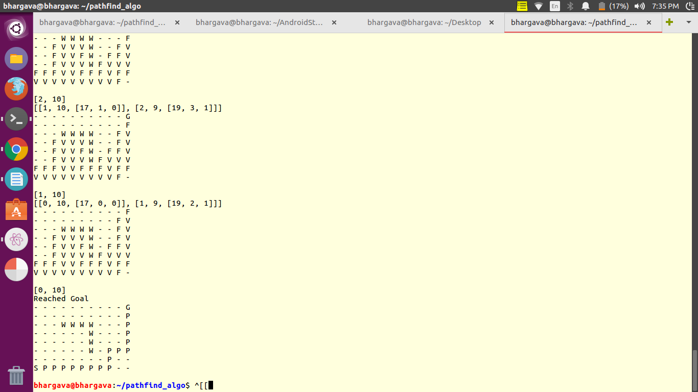

# Maze-Solver
A Maze Path Finder Implemented in Python with the help of A* Algorithm including both the Terminal Version and User Interface Version
## Terminal Version

&nbsp;&nbsp;&nbsp;&nbsp;
This version solves the maze in the terminal itself and prints the maze for each update like visit,add to frontier etc. It uses the basic A* algorithm to solve and the Heuristic is the Manhattan distance from the present state to the goal state. The allowed direction of movement from any state is only North, South, East and West. In other words diagnol movement is not possible.
 
&nbsp;&nbsp;&nbsp;&nbsp;Finally after the path has been found the maze is printed in the teminal along with the shortest path denoted by ‘P’ from the start state ‘S’ and the goal state ‘G’. The walls are denoted by ‘W’ . If a block has been visited by the algorithm while exploring the path then it is denoted by ‘V’ . If a block has been added to the frontier but not yet visited, then it is denoted by ‘F’. The rest all blocks are denoted by ‘-’. 
 
&nbsp;&nbsp;&nbsp;&nbsp;
The Input format is defined as follows
<ul>
<li> Number of Rows and Columns </li>
<li> Start State's Row and Column (0-indexed) </li>
<li> Goal State's Row and Column (0-indexed) </li>
<li> Number of Walls = k </li>
<li> The Wall Rows and columns in k lines </li>
</ul>
Sample Test Case is given below 
8 11 
7 0 
0 10 
7 
2 3 
2 4 
2 5 
2 6 
3 6 
4 6 
5 6 

Shown below are some Sample Test Cases Outputs which shows the shortest path from start state to goal in the bottom of every picture 

